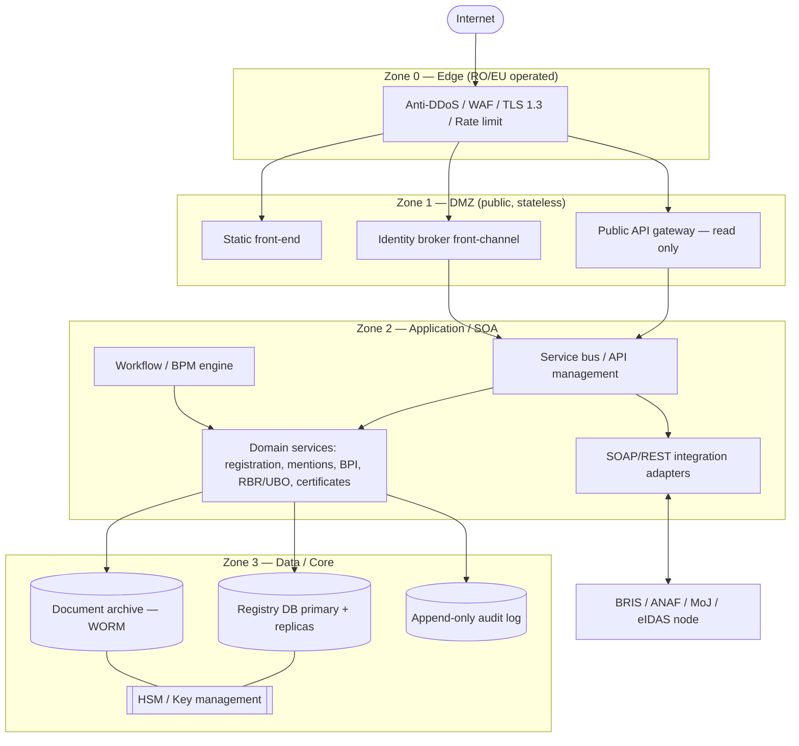

# Deployment & Sovereign Architecture

Reference architecture for deploying the NTRO / ONRC trade-register web platform
safely, with full data and operational sovereignty.

This document covers two layers:

1. **The front-end in this repository** — a static site (`index.html`, `css/`,
   `js/`, `img/`). Deploying it safely is a small, self-contained problem.
2. **The full registry platform** — the service-oriented backend that such a
   public face fronts (company registration, amendments, BPI, RBR/UBO,
   certificates, BRIS interconnection). This is where "deploy safely +
   sovereign" fully applies.

---

## 1. Scope

| Layer | What it is | Deployment concern |
|---|---|---|
| **Front-end (this repo)** | Static HTML/CSS/JS, no server, no data | Hardened static hosting, headers, CSP, EU-resident assets |
| **Registry platform** | SOA backend, integration bus, registry DB, document archive | Zoned network, key sovereignty, HA/DR, NIS2/ISO 27001/GDPR/eIDAS |

The static front-end has no data to lose; the platform holds the national
company register and personal data, so it carries the real risk and the real
sovereignty requirements.

---

## 2. Sovereignty principles (the design contract)

Every topology and vendor decision is justified against these pillars. The
difference between "hosted in Romania" and *actually sovereign* is control of
**keys + operations + exit**, not just rack location.

| Pillar | Requirement |
|---|---|
| **Data residency** | All registry data, PII, backups, and logs stored and processed in RO/EU only. No replication to non-EU regions. |
| **Operational sovereignty** | Root/admin access, encryption keys, and break-glass held only by Romanian-vetted personnel. No foreign operator with standing admin rights. |
| **Legal sovereignty** | Subject only to RO/EU jurisdiction. Avoid non-EU-controlled cloud control planes (e.g. CLOUD Act exposure), or neutralise them with customer-held keys (HYOK/BYOK + external HSM). |
| **Technological sovereignty** | Open standards, portable workloads (OCI containers, PostgreSQL, S3-compatible storage), documented exit plan. No lock-in that blocks migration. |
| **Continuity** | The state can keep the registry running even if a private contractor or vendor relationship ends. |

---

## 3. Reference architecture — security zones

Four trust zones. Traffic flows only inward, through controlled choke points.
No zone talks to a zone more than one step deeper, and every hop is
authenticated (mTLS) and allow-listed. The internet never reaches the
application or data tiers.

```
        INTERNET
           │
    ┌──────▼───────────────────────────────┐  Zone 0: EDGE
    │  Anti-DDoS / WAF / TLS termination    │  (sovereign CDN/scrubbing,
    │  Reverse proxy + rate limiting        │   RO/EU operated)
    └──────┬────────────────────────────────┘
           │ (only 443, filtered)
    ┌──────▼────────────────────────────────┐  Zone 1: DMZ (public)
    │  Static front-end (this repo)          │
    │  Public API gateway (read-only data)   │
    │  Identity broker front-channel         │
    └──────┬────────────────────────────────┘
           │ (mTLS, allow-listed service calls)
    ┌──────▼────────────────────────────────┐  Zone 2: APPLICATION / SOA
    │  Service bus / API management           │
    │  Microservices: registration, mentions,│
    │   BPI, RBR/UBO, certificates (InfoCert) │
    │  Workflow / BPM engine                  │
    │  SOAP/REST adapters (BRIS, ANAF, MoJ)   │
    └──────┬────────────────────────────────┘
           │ (segmented, no direct internet)
    ┌──────▼────────────────────────────────┐  Zone 3: DATA / CORE
    │  Registry DB (primary + replicas)       │
    │  Document store / archive (WORM)        │
    │  HSM / key management                   │
    │  Audit log store (append-only)          │
    └─────────────────────────────────────────┘
```

### Mermaid version



---

## 4. Network segmentation & DMZ

- **Edge (Zone 0):** TLS 1.3 termination, WAF (OWASP ruleset tuned for the
  forms), L7 rate-limiting, bot/DDoS scrubbing. Use an **EU/RO-operated**
  scrubbing service, not a non-EU hyperscaler edge, to hold the sovereignty
  line.
- **DMZ (Zone 1):** stateless. Serves the static site and hosts the **public
  API gateway** exposing only *read* operations (company search) and brokering
  logins. A compromise here yields no registry data because the DMZ holds none.
- **Inner firewalls:** default-deny between every zone, including **egress
  filtering** so Zone 2/3 cannot make arbitrary outbound calls (anti-
  exfiltration). Cross-border integration (BRIS) goes through a dedicated,
  allow-listed integration gateway — not general egress.
- **Admin plane:** entirely out-of-band — a separate management VLAN reachable
  only via bastion + MFA + PAM (privileged access management) with session
  recording. No admin path from the public network.

---

## 5. Application / SOA tier

Matches a service-oriented, web-service-heavy enterprise-government backend.

- **API management + service bus** as the single integration spine. Internal
  systems publish services; consumers bind through the bus, not point-to-point.
- **Domain services** decomposed by registry function: *company registration*,
  *amendments/mentions*, *BPI (insolvency)*, *RBR/UBO*, *certificates
  (InfoCert/RECOM)*, *BRIS connector*. Each owns its data and contracts.
- **Workflow / BPM engine** for stateful legal procedures (a file moves through
  submission → examination → resolution → publication).
- **Async by default** for cross-system work (message queue), so an
  ANAF/MoJ/BRIS slowdown doesn't take the portal down.
- **Backwards-compatible SOAP adapters** wrapped behind modern REST internally —
  keep legacy institutional integrations without exposing SOAP at the edge.

---

## 6. Data tier

- **Primary registry DB** (e.g. PostgreSQL) with a synchronous replica in the
  same DC and an **asynchronous replica in a second Romanian DC** for DR.
- **Document archive** on WORM/object storage (legal immutability), with
  retention matching Romanian archival law.
- **Encryption everywhere:** TLS in transit, AES-256 at rest, keys in an **HSM
  under Romanian control**. This is the linchpin of sovereignty — even a
  contractor-operated infrastructure operator cannot read data without the
  state-held keys.
- **Append-only audit log** in a separate, tamper-evident store (who accessed or
  changed what) — required for NIS2 and GDPR accountability.

---

## 7. Identity & trust (eIDAS)

- Authentication via **eIDAS-compliant** national eID + **qualified electronic
  signatures** for legally binding submissions; card-payment path (InfoCert) for
  unauthenticated certificate purchases.
- An **identity broker** in the DMZ front-channel; credential validation and
  signature verification happen in Zone 2 against qualified trust-service
  providers.
- Cross-border login support via the **eIDAS node** for EU citizens/businesses.

---

## 8. Hosting & sovereignty model

Three models, in increasing sovereignty (and cost/effort):

1. **Government-owned DC, state-operated** — maximum sovereignty, highest
   capex/skills burden.
2. **Hybrid (recommended):** state-owned core data tier + HSM/keys; contractor-
   operated compute/infra under strict contract, RO personnel vetting, and
   **keys never leaving state control**. Vendor capacity without surrendering
   legal/operational control.
3. **EU sovereign cloud** — an EU-operated, EU-jurisdiction cloud, or a
   hyperscaler "sovereign region" with **external key management + EU-staffed
   operations**. Acceptable only if the control plane and keys are provably
   outside non-EU jurisdiction.

For a registry of national record, **model 2 with two Romanian data centers**
(active/standby DR), with **keys + audit + DR owned by the state**, is the
defensible sweet spot. An explicit **exit clause** (data + container images +
IaC handed back on demand) is what keeps a contractor model sovereign.

---

## 9. Security & compliance controls

| Regime | What it requires here |
|---|---|
| **NIS2** (essential entity) | 24/7 monitoring, incident-reporting workflow, supply-chain risk management, board accountability |
| **ISO/IEC 27001** | Documented ISMS — the control set behind the badge |
| **GDPR** | Data minimisation, lawful-basis register, DPIA for UBO/PII flows, data-subject-rights tooling, EU-only processing |
| **eIDAS** | Qualified trust services for signatures/seals |

Concrete controls: WAF, IDS/IPS, secrets manager (no credentials in code or
images), centralised SIEM feeding a SOC, regular pen-tests, signed and scanned
container images, least-privilege IAM, MFA + PAM for all admin access.

---

## 10. Availability, DR, continuity

- **Active/standby across two RO data centers**, async DB replication, tested
  failover.
- Defined **RPO/RTO** (e.g. RPO ≤ 15 min, RTO ≤ 1–2 h for the public portal;
  tighter for read-only search).
- **Immutable, encrypted, EU-resident backups** with periodic restore drills.
- **Graceful degradation:** if the transactional core is down, read-only public
  search stays up from a replica behind the DMZ cache.

---

## 11. CI/CD & supply chain

- Everything as **Infrastructure as Code** — reproducible, portable, and the
  practical exit guarantee.
- Pipeline: build → SAST + dependency scan → **sign artifacts (SBOM +
  provenance)** → push to a private RO-hosted registry → deploy. No unsigned
  image runs.
- Secrets from a vault, injected at runtime; none in the repo or images.
- Separate dev / stage / prod environments; prod deploys gated by approval and a
  change record.

---

## 12. Observability & SOC

- Centralised logs/metrics/traces in **EU-resident** stores (logs carry PII and
  count toward residency).
- SIEM + 24/7 SOC, alerting on auth anomalies, WAF events, and egress attempts
  from inner zones.
- Synthetic monitoring of the public golden paths (search, login, certificate
  purchase).

---

## 13. Concrete path for this repository (front-end)

The artifact today is static, so the safe minimum is small and worth doing
regardless of the platform design:

1. Serve from a hardened static host / reverse proxy (nginx or Caddy) in the
   **DMZ only** — it has no data to lose.
2. **Security headers:** HSTS, strict CSP, `X-Content-Type-Options: nosniff`,
   `Referrer-Policy`, `frame-ancestors 'none'`.
3. **Self-host the web font.** The page currently loads
   `fonts.googleapis.com` — a third-party, non-EU request that is both a CSP
   weakness and a sovereignty leak for an official site. Bundle the font with
   the site assets.
4. **Remove inline event handlers** (e.g. `onmouseover=` in the footer) and
   inline styles where practical, so the CSP can drop `unsafe-inline`.
5. TLS 1.3 + automated certificate renewal; redirect all HTTP → HTTPS.
6. WAF + rate-limit in front of the static host.
7. CI that scans and deploys **signed** artifacts to an RO-hosted target.

This makes the front-end deployment defensible without touching the backend.

### Example hardened response headers (nginx)

```nginx
add_header Strict-Transport-Security "max-age=63072000; includeSubDomains; preload" always;
add_header X-Content-Type-Options "nosniff" always;
add_header Referrer-Policy "strict-origin-when-cross-origin" always;
add_header Content-Security-Policy "default-src 'self'; img-src 'self' data:; style-src 'self'; font-src 'self'; script-src 'self'; frame-ancestors 'none'; base-uri 'self'; form-action 'self'" always;
add_header Permissions-Policy "geolocation=(), microphone=(), camera=()" always;
```

> Note: a strict CSP requires self-hosting the font (item 3) and removing inline
> handlers/styles (item 4) first. Until then, the policy above would block the
> Google Fonts request and any inline `on*` handlers — which is the intended end
> state, reached by fixing the markup rather than loosening the policy.
